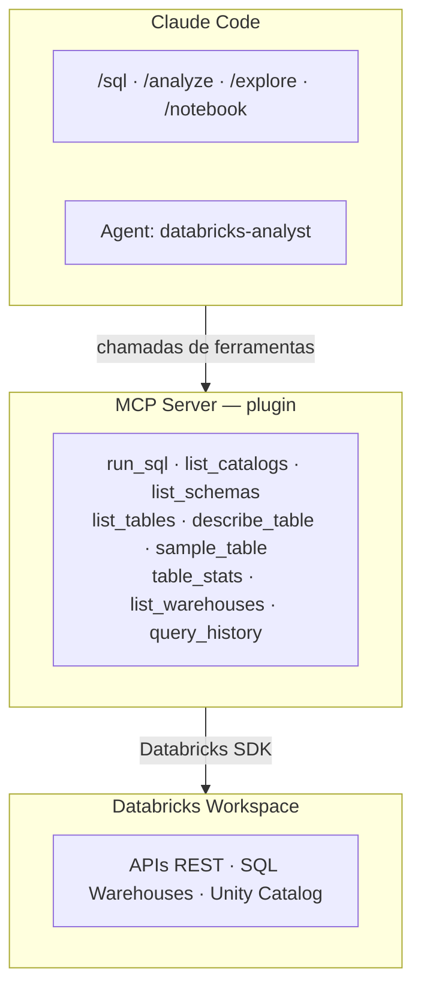

# Databricks + Claude Code — Data Team Toolkit

Toolkit de integração entre Claude Code e Databricks para o time de Dados.
Inclui um MCP Server (plugin), agente especializado e skills (slash commands) prontos para uso.

## Pré-requisitos

- Python 3.10+
- [Claude Code](https://docs.anthropic.com/en/docs/claude-code) instalado
- Acesso ao workspace Databricks
- Token de acesso pessoal (PAT) do Databricks

## Instalação (uma vez por máquina)

```bash
# 1. Clone este repositório
git clone <repo-url> && cd databricks

# 2. Rode o instalador
./install.sh
```

O instalador faz o seguinte:
- Copia o MCP Server para `~/.local/share/databricks-mcp/`
- Cria o ambiente virtual com as dependências
- Configura o gitignore global (`.mcp.json` nunca sobe no git)
- Adiciona o comando `databricks-mcp-init` ao seu shell

## Uso em qualquer projeto

Depois de instalado, basta rodar em qualquer repo:

```bash
cd ~/meu-projeto-databricks     # qualquer repo clonado
databricks-mcp-init             # configura MCP + skills + agent
```

Na primeira vez, crie o `.env` com suas credenciais:

```bash
cat > .env << 'EOF'
DATABRICKS_HOST=https://<seu-workspace>.cloud.databricks.com/
DATABRICKS_TOKEN=<seu_token_aqui>
EOF
```

Depois inicie o Claude Code normalmente:

```bash
claude
```

> Nada disso vai para o git. O `.mcp.json` é ignorado globalmente e o `.env` contém credenciais pessoais.

## Arquitetura

O toolkit é composto por 3 camadas que trabalham juntas:



### Onde cada coisa fica

**Instalação global** (uma vez por máquina, via `./install.sh`):

```
~/.local/share/databricks-mcp/
├── server.py                     ← MCP Server
├── .venv/                        ← Python + dependências
├── setup.sh                      ← Script de setup por projeto
├── commands/                     ← Templates das skills
│   ├── sql.md
│   ├── analyze.md
│   ├── notebook.md
│   └── explore.md
└── agents/
    └── databricks-analyst.md
```

**Por projeto** (gerado pelo `databricks-mcp-init`):

```
~/qualquer-projeto/
├── .mcp.json                     ← Aponta para o server global (gitignored)
├── .env                          ← Credenciais pessoais (gitignored)
└── .claude/
    ├── commands/                  ← Skills copiadas
    │   ├── sql.md
    │   ├── analyze.md
    │   ├── notebook.md
    │   └── explore.md
    └── agents/
        └── databricks-analyst.md
```

## MCP Server — Ferramentas disponíveis

O MCP Server roda localmente e expõe ferramentas que o Claude Code chama diretamente.

| Ferramenta | Descrição | Exemplo de uso |
|---|---|---|
| `run_sql` | Executa query SQL e retorna resultados formatados | `run_sql("SELECT * FROM silver.ibge.ipca_mensal LIMIT 10")` |
| `list_catalogs` | Lista todos os catálogos do Unity Catalog | Exploração inicial do workspace |
| `list_schemas` | Lista schemas de um catálogo | `list_schemas("silver")` |
| `list_tables` | Lista tabelas de um schema | `list_tables("silver", "ibge")` |
| `describe_table` | Retorna schema detalhado (colunas, tipos, comentários) | `describe_table("silver.ibge.ipca_mensal")` |
| `sample_table` | Amostra rápida de dados | `sample_table("silver.ibge.ipca_mensal", rows=10)` |
| `table_stats` | Estatísticas: contagem, nulos, cardinalidade | `table_stats("silver.ibge.ipca_mensal")` |
| `list_warehouses` | Lista SQL Warehouses e seus estados | Verificar warehouse disponível |
| `query_history` | Histórico de queries recentes | Auditoria e debug |

### Como funciona

O servidor usa o protocolo [MCP (Model Context Protocol)](https://modelcontextprotocol.io/) via `stdio`.
Ele é iniciado automaticamente pelo Claude Code ao abrir o projeto, conforme configurado no `.mcp.json`.

O servidor se conecta ao Databricks usando as credenciais do `.env` e seleciona automaticamente um SQL Warehouse que esteja em estado `RUNNING`. O client e o warehouse são cacheados para evitar reconexões desnecessárias.

## Skills — Slash commands

Skills são atalhos que injetam prompts especializados no Claude Code. Basta digitar o comando no chat.

### `/sql` — Executar SQL

```
/sql SELECT * FROM silver.ibge.ipca_mensal WHERE valor > 5 ORDER BY data_referencia
```

Também aceita linguagem natural:

```
/sql me mostra as 10 maiores variações do IPCA
```

### `/analyze` — Análise exploratória (EDA)

```
/analyze silver.ibge.ipca_mensal
```

Executa automaticamente:
1. Leitura do schema (colunas e tipos)
2. Estatísticas descritivas (contagem, nulos, cardinalidade)
3. Amostra de dados reais
4. Distribuições de valores
5. Verificações de data quality

### `/notebook` — Criar notebook PySpark

```
/notebook análise de tendência do IPCA com média móvel de 3 meses
```

Gera um arquivo `.py` no formato Databricks com:
- Separadores `# COMMAND ----------`
- Células de documentação com `# MAGIC %md`
- Código PySpark estruturado e comentado

### `/explore` — Navegar Unity Catalog

```
/explore                           # lista catálogos
/explore silver                    # lista schemas do catálogo silver
/explore silver.ibge               # lista tabelas do schema ibge
/explore silver.ibge.ipca_mensal   # descreve a tabela
```

## Agent — databricks-analyst

O agente especializado é acionado automaticamente pelo Claude Code para tarefas complexas de análise de dados. Ele possui:

- Prompt de **Engenheiro de Dados sênior**
- Acesso a todas as 9 ferramentas MCP do Databricks
- Fluxo de análise estruturado (describe → stats → sample → query)
- Conhecimento de boas práticas em SQL, PySpark e data quality

O agente é invocado quando você pede coisas como:
- "analisa a tabela X pra mim"
- "cria um notebook que calcula Y"
- "roda esse SQL e me explica o resultado"

## Compartilhamento e onboarding

### Para novos membros do time

1. Clone este repo e rode `./install.sh`
2. Gere seu token Databricks (ver abaixo)
3. Em qualquer projeto, rode `databricks-mcp-init` e crie o `.env`

### Gerando seu token Databricks

1. Acesse o workspace: https://<seu-workspace>.cloud.databricks.com/
2. Clique no seu perfil (canto superior direito) → **Settings**
3. Vá em **Developer** → **Access tokens**
4. Clique em **Generate new token**
5. Copie o token e cole no seu arquivo `.env`

### O que vai no git vs o que fica local

| Vai no git (este repo) | Fica local (por máquina) |
|---|---|
| `databricks_mcp/server.py` | `~/.local/share/databricks-mcp/` (instalação global) |
| `.claude/commands/*.md` | `.mcp.json` (gerado por `databricks-mcp-init`) |
| `.claude/agents/*.md` | `.env` (credenciais pessoais) |
| `install.sh` | `.venv/` (ambiente virtual) |
| `CLAUDE.md` | `.claude/settings.local.json` (permissões locais) |
| `README.md` | |
| `databricks.yml` | |

## Customização

### Trocar o SQL Warehouse padrão

Por padrão, o MCP Server usa o primeiro warehouse em estado `RUNNING`. Para fixar um warehouse específico, adicione no `.env`:

```
DATABRICKS_WAREHOUSE_ID=be747c7982bd068f
```

### Adicionar novas ferramentas ao MCP Server

Edite `databricks_mcp/server.py` e adicione uma nova função decorada com `@mcp.tool()`:

```python
@mcp.tool()
def minha_ferramenta(parametro: str) -> str:
    """Descrição da ferramenta.

    Args:
        parametro: Descrição do parâmetro.
    """
    client = _get_client()
    # sua lógica aqui
    return "resultado"
```

Após editar, rode `./install.sh` novamente para atualizar a instalação global.

### Adicionar novas skills

Crie um arquivo `.md` em `.claude/commands/`:

```markdown
---
description: Descrição curta da skill
allowed-tools: mcp__databricks__run_sql, mcp__databricks__describe_table
---

Instruções para o Claude sobre o que fazer.

$ARGUMENTS
```

A skill fica disponível imediatamente como `/nome-do-arquivo`.
Rode `./install.sh` para atualizar os templates globais.

## Troubleshooting

| Problema | Solução |
|---|---|
| MCP Server não aparece | Reinicie o Claude Code (`exit` + `claude`) |
| Erro de autenticação | Verifique se o `.env` tem `DATABRICKS_HOST` e `DATABRICKS_TOKEN` corretos |
| Nenhum warehouse disponível | Acesse o workspace e inicie um SQL Warehouse |
| `wait_timeout` error | O timeout máximo da API é 50s — queries longas podem precisar de polling |
| Python não encontrado | Verifique se tem Python 3.10+ instalado (`python3 --version`) |
| `databricks-mcp-init` não encontrado | Rode `source ~/.zshrc` ou abra um novo terminal |
| Skills não aparecem | Verifique se `.claude/commands/` existe e tem os arquivos `.md` |
