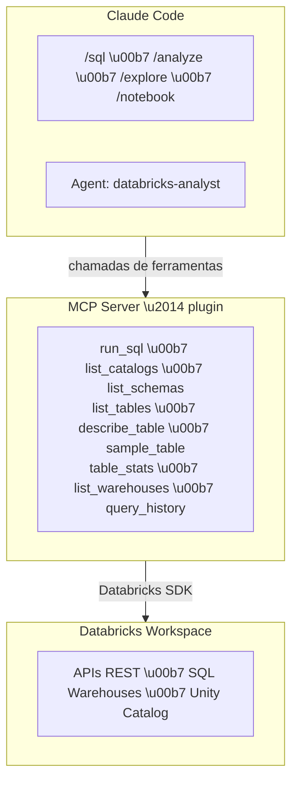

# Databricks MCP Toolkit

**Conecte o Claude Code ao seu workspace Databricks e transforme linguagem natural em queries, an\u00e1lises e notebooks -- sem sair do terminal.**

O Databricks MCP Toolkit \u00e9 um pacote completo de integra\u00e7\u00e3o entre o [Claude Code](https://docs.anthropic.com/en/docs/claude-code) e o Databricks. Ele inclui um MCP Server com 9 ferramentas, um agente especializado em dados e 4 skills (slash commands) prontos para uso imediato.

---

## Por que usar

Analistas e engenheiros de dados passam boa parte do dia alternando entre terminal, notebook, documenta\u00e7\u00e3o de tabelas e UI do Databricks. Este toolkit elimina essa troca de contexto: voc\u00ea faz perguntas, explora cat\u00e1logos, roda SQL e gera notebooks PySpark diretamente no Claude Code, usando linguagem natural ou comandos dedicados.

- **Sem troca de contexto** -- tudo acontece no terminal onde voc\u00ea j\u00e1 est\u00e1
- **SQL via linguagem natural** -- descreva o que precisa, o agente monta a query
- **Explora\u00e7\u00e3o guiada** -- navegue Unity Catalog de forma progressiva e estruturada
- **Notebooks prontos** -- gere arquivos `.py` no formato Databricks com um comando
- **Seguran\u00e7a por padr\u00e3o** -- credenciais ficam em `.env` local, nunca sobem no git

---

## Agentes dispon\u00edveis

O toolkit inclui um agente especializado que \u00e9 acionado automaticamente pelo Claude Code para tarefas complexas de an\u00e1lise de dados.

### `databricks-analyst`

| Atributo | Detalhe |
|---|---|
| **Modelo** | Sonnet |
| **Perfil** | Engenheiro de Dados e Analista s\u00eanior |
| **Ferramentas** | Todas as 9 ferramentas MCP do Databricks + Read, Write, Edit, Bash, Glob, Grep |

**Capacidades:**

1. **Explora\u00e7\u00e3o de dados** -- navegar cat\u00e1logos, schemas e tabelas do Unity Catalog
2. **SQL Analytics** -- escrever e executar queries SQL otimizadas
3. **An\u00e1lise estat\u00edstica** -- gerar estat\u00edsticas descritivas, distribui\u00e7\u00f5es, correla\u00e7\u00f5es
4. **Data Quality** -- identificar nulos, duplicatas, outliers e inconsist\u00eancias
5. **PySpark** -- escrever e revisar c\u00f3digo PySpark para transforma\u00e7\u00f5es
6. **Notebooks** -- criar notebooks Databricks com an\u00e1lises completas

**Quando \u00e9 acionado:**

O agente entra em a\u00e7\u00e3o quando voc\u00ea pede coisas como:
- "analisa a tabela X pra mim"
- "cria um notebook que calcula Y"
- "roda esse SQL e me explica o resultado"

**Fluxo de an\u00e1lise estruturado:**

O agente segue uma metodologia consistente: `describe_table` (entender colunas e tipos) \u2192 `table_stats` (vis\u00e3o geral de nulos e cardinalidade) \u2192 `sample_table` (ver dados reais) \u2192 `run_sql` (queries espec\u00edficas de an\u00e1lise).

---

## Skills -- Slash Commands

Skills s\u00e3o atalhos que injetam prompts especializados no Claude Code. Basta digitar o comando no chat.

### `/sql` -- Executar SQL

Executa queries SQL diretamente ou gera SQL a partir de linguagem natural.

```
/sql SELECT * FROM silver.ibge.ipca_mensal WHERE valor > 5 ORDER BY data_referencia
```

Tamb\u00e9m aceita linguagem natural:

```
/sql me mostra as 10 maiores varia\u00e7\u00f5es do IPCA
```

O que acontece por baixo: se voc\u00ea fornece uma query pronta, ela \u00e9 executada diretamente. Se descreve o que quer, o Claude primeiro inspeciona as tabelas com `describe_table`, monta a query e ent\u00e3o executa.

---

### `/analyze` -- An\u00e1lise explorat\u00f3ria (EDA)

Executa uma an\u00e1lise explorat\u00f3ria completa de qualquer tabela.

```
/analyze silver.ibge.ipca_mensal
```

**Etapas executadas automaticamente:**

1. Leitura do schema (colunas e tipos)
2. Estat\u00edsticas descritivas (contagem, nulos, cardinalidade)
3. Amostra de dados reais
4. Distribui\u00e7\u00f5es de valores (categ\u00f3ricas, num\u00e9ricas, temporais)
5. Verifica\u00e7\u00f5es de data quality (nulos, duplicatas, outliers)

O resultado \u00e9 apresentado em markdown organizado, com uma se\u00e7\u00e3o final de observa\u00e7\u00f5es e insights.

---

### `/notebook` -- Criar notebook PySpark

Gera um arquivo `.py` no formato nativo de notebooks Databricks.

```
/notebook an\u00e1lise de tend\u00eancia do IPCA com m\u00e9dia m\u00f3vel de 3 meses
```

**O notebook gerado inclui:**

- Header `# Databricks notebook source`
- Separadores de c\u00e9lula `# COMMAND ----------`
- C\u00e9lulas de documenta\u00e7\u00e3o com `# MAGIC %md`
- C\u00f3digo PySpark estruturado e comentado
- C\u00e9lula de valida\u00e7\u00e3o/verifica\u00e7\u00e3o ao final

---

### `/explore` -- Navegar Unity Catalog

Navega\u00e7\u00e3o progressiva pelo Unity Catalog, do n\u00edvel mais alto at\u00e9 o detalhe de uma tabela.

```
/explore                           # lista cat\u00e1logos
/explore silver                    # lista schemas do cat\u00e1logo silver
/explore silver.ibge               # lista tabelas do schema ibge
/explore silver.ibge.ipca_mensal   # descreve a tabela completa
```

---

## Ferramentas MCP

O MCP Server roda localmente e exp\u00f5e 9 ferramentas que o Claude Code chama diretamente via o protocolo [MCP (Model Context Protocol)](https://modelcontextprotocol.io/) por `stdio`. O servidor \u00e9 iniciado automaticamente ao abrir o projeto, conforme configurado no `.mcp.json`.

| Ferramenta | Descri\u00e7\u00e3o | Exemplo de uso |
|---|---|---|
| `run_sql` | Executa query SQL e retorna resultados formatados em markdown | `run_sql("SELECT * FROM silver.ibge.ipca_mensal LIMIT 10")` |
| `list_catalogs` | Lista todos os cat\u00e1logos do Unity Catalog | Explora\u00e7\u00e3o inicial do workspace |
| `list_schemas` | Lista schemas de um cat\u00e1logo | `list_schemas("silver")` |
| `list_tables` | Lista tabelas de um schema | `list_tables("silver", "ibge")` |
| `describe_table` | Retorna schema detalhado (colunas, tipos, coment\u00e1rios) | `describe_table("silver.ibge.ipca_mensal")` |
| `sample_table` | Amostra r\u00e1pida de dados de uma tabela | `sample_table("silver.ibge.ipca_mensal", rows=10)` |
| `table_stats` | Estat\u00edsticas: contagem, nulos, cardinalidade por coluna | `table_stats("silver.ibge.ipca_mensal")` |
| `list_warehouses` | Lista SQL Warehouses e seus estados | Verificar warehouse dispon\u00edvel |
| `query_history` | Hist\u00f3rico de queries recentes no workspace | Auditoria e debug |

**Como funciona a conex\u00e3o:** o servidor se conecta ao Databricks usando as credenciais do `.env` e seleciona automaticamente um SQL Warehouse em estado `RUNNING`. O client e o warehouse s\u00e3o cacheados para evitar reconex\u00f5es desnecess\u00e1rias.

---

## Instala\u00e7\u00e3o

A instala\u00e7\u00e3o \u00e9 feita uma \u00fanica vez por m\u00e1quina.

### Pr\u00e9-requisitos

- Python 3.10+
- [Claude Code](https://docs.anthropic.com/en/docs/claude-code) instalado
- Acesso ao workspace Databricks
- Token de acesso pessoal (PAT) do Databricks

### Passos

```bash
# 1. Clone este reposit\u00f3rio
git clone <repo-url> && cd databricks

# 2. Rode o instalador
./install.sh
```

**O que o instalador faz:**

- Copia o MCP Server para `~/.local/share/databricks-mcp/`
- Cria o ambiente virtual com as depend\u00eancias (`databricks-connect`, `databricks-sdk`, `mcp[cli]`, `python-dotenv`)
- Configura o gitignore global (`.mcp.json` nunca sobe no git)
- Adiciona o comando `databricks-mcp-init` ao seu shell

---

## Uso em qualquer projeto

Depois de instalado globalmente, basta rodar em qualquer reposit\u00f3rio:

```bash
cd ~/meu-projeto-databricks     # qualquer repo clonado
databricks-mcp-init             # configura MCP + skills + agent
```

Na primeira vez, crie o `.env` com suas credenciais:

```bash
cat > .env << 'EOF'
DATABRICKS_HOST=https://<seu-workspace>.cloud.databricks.com/
DATABRICKS_TOKEN=<seu_token_aqui>
DATABRICKS_WAREHOUSE_ID=<opcional_warehouse_id>
EOF
```

> `DATABRICKS_WAREHOUSE_ID` \u00e9 opcional. Se omitido, o servidor usa automaticamente o primeiro warehouse em estado `RUNNING`.

Depois, inicie o Claude Code normalmente:

```bash
claude
```

> Nada disso vai para o git. O `.mcp.json` \u00e9 ignorado globalmente e o `.env` cont\u00e9m credenciais pessoais.

---

## Arquitetura

O toolkit \u00e9 composto por 3 camadas que trabalham juntas:



### Estrutura de pastas

**Instala\u00e7\u00e3o global** (uma vez por m\u00e1quina, via `./install.sh`):

```
~/.local/share/databricks-mcp/
\u251c\u2500\u2500 server.py                     \u2190 MCP Server
\u251c\u2500\u2500 .venv/                        \u2190 Python + depend\u00eancias
\u251c\u2500\u2500 setup.sh                      \u2190 Script de setup por projeto
\u251c\u2500\u2500 commands/                     \u2190 Templates das skills
\u2502   \u251c\u2500\u2500 sql.md
\u2502   \u251c\u2500\u2500 analyze.md
\u2502   \u251c\u2500\u2500 notebook.md
\u2502   \u2514\u2500\u2500 explore.md
\u2514\u2500\u2500 agents/
    \u2514\u2500\u2500 databricks-analyst.md
```

**Por projeto** (gerado pelo `databricks-mcp-init`):

```
~/qualquer-projeto/
\u251c\u2500\u2500 .mcp.json                     \u2190 Aponta para o server global (gitignored)
\u251c\u2500\u2500 .env                          \u2190 Credenciais pessoais (gitignored)
\u2514\u2500\u2500 .claude/
    \u251c\u2500\u2500 commands/                  \u2190 Skills copiadas
    \u2502   \u251c\u2500\u2500 sql.md
    \u2502   \u251c\u2500\u2500 analyze.md
    \u2502   \u251c\u2500\u2500 notebook.md
    \u2502   \u2514\u2500\u2500 explore.md
    \u2514\u2500\u2500 agents/
        \u2514\u2500\u2500 databricks-analyst.md
```

---

## Customiza\u00e7\u00e3o

### Vari\u00e1veis do `.env`

| Vari\u00e1vel | Obrigat\u00f3ria | Descri\u00e7\u00e3o |
|---|---|---|
| `DATABRICKS_HOST` | Sim | URL do workspace (ex: `https://dbc-xxx.cloud.databricks.com/`) |
| `DATABRICKS_TOKEN` | Sim | Token de acesso pessoal (PAT) |
| `DATABRICKS_WAREHOUSE_ID` | N\u00e3o | ID do SQL Warehouse. Se omitido, usa o primeiro em estado `RUNNING` |

### Adicionar novas ferramentas ao MCP Server

Edite `databricks_mcp/server.py` e adicione uma nova fun\u00e7\u00e3o decorada com `@mcp.tool()`:

```python
@mcp.tool()
def minha_ferramenta(parametro: str) -> str:
    """Descri\u00e7\u00e3o da ferramenta.

    Args:
        parametro: Descri\u00e7\u00e3o do par\u00e2metro.
    """
    client = _get_client()
    # sua l\u00f3gica aqui
    return "resultado"
```

Ap\u00f3s editar, rode `./install.sh` novamente para atualizar a instala\u00e7\u00e3o global.

### Adicionar novas skills

Crie um arquivo `.md` em `.claude/commands/`:

```markdown
---
description: Descri\u00e7\u00e3o curta da skill
allowed-tools: mcp__databricks__run_sql, mcp__databricks__describe_table
---

Instru\u00e7\u00f5es para o Claude sobre o que fazer.

$ARGUMENTS
```

A skill fica dispon\u00edvel imediatamente como `/nome-do-arquivo`. Rode `./install.sh` para atualizar os templates globais.

---

## Compartilhamento e onboarding

### Para novos membros do time

1. Clone este repo e rode `./install.sh`
2. Gere seu token Databricks (ver instru\u00e7\u00f5es abaixo)
3. Em qualquer projeto, rode `databricks-mcp-init` e crie o `.env`

### Gerando seu token Databricks

1. Acesse o workspace: `https://<seu-workspace>.cloud.databricks.com/`
2. Clique no seu perfil (canto superior direito) \u2192 **Settings**
3. V\u00e1 em **Developer** \u2192 **Access tokens**
4. Clique em **Generate new token**
5. Copie o token e cole no seu arquivo `.env`

### O que vai no git vs o que fica local

| Vai no git (este repo) | Fica local (por m\u00e1quina) |
|---|---|
| `databricks_mcp/server.py` | `~/.local/share/databricks-mcp/` (instala\u00e7\u00e3o global) |
| `.claude/commands/*.md` | `.mcp.json` (gerado por `databricks-mcp-init`) |
| `.claude/agents/*.md` | `.env` (credenciais pessoais) |
| `install.sh` | `.venv/` (ambiente virtual) |
| `CLAUDE.md` | `.claude/settings.local.json` (permiss\u00f5es locais) |
| `README.md` | |
| `databricks.yml` | |

---

## Troubleshooting

| Problema | Solu\u00e7\u00e3o |
|---|---|
| MCP Server n\u00e3o aparece | Reinicie o Claude Code (`exit` + `claude`) |
| Erro de autentica\u00e7\u00e3o | Verifique se o `.env` tem `DATABRICKS_HOST` e `DATABRICKS_TOKEN` corretos |
| Nenhum warehouse dispon\u00edvel | Acesse o workspace e inicie um SQL Warehouse |
| `wait_timeout` error | O timeout m\u00e1ximo da API \u00e9 50s -- queries longas podem precisar de polling |
| Python n\u00e3o encontrado | Verifique se tem Python 3.10+ instalado (`python3 --version`) |
| `databricks-mcp-init` n\u00e3o encontrado | Rode `source ~/.zshrc` ou abra um novo terminal |
| Skills n\u00e3o aparecem | Verifique se `.claude/commands/` existe e tem os arquivos `.md` |
