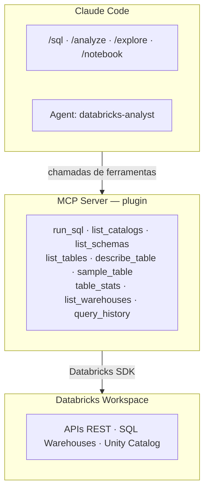

# Databricks MCP Toolkit

**Conecte o Claude Code ao seu workspace Databricks e transforme linguagem natural em queries, análises e notebooks -- sem sair do terminal.**

O Databricks MCP Toolkit é um pacote completo de integração entre o [Claude Code](https://docs.anthropic.com/en/docs/claude-code) e o Databricks. Ele inclui um MCP Server com 9 ferramentas, um agente especializado em dados e 4 skills (slash commands) prontos para uso imediato.

---

## Por que usar

Analistas e engenheiros de dados passam boa parte do dia alternando entre terminal, notebook, documentação de tabelas e UI do Databricks. Este toolkit elimina essa troca de contexto: você faz perguntas, explora catálogos, roda SQL e gera notebooks PySpark diretamente no Claude Code, usando linguagem natural ou comandos dedicados.

- **Sem troca de contexto** -- tudo acontece no terminal onde você já está
- **SQL via linguagem natural** -- descreva o que precisa, o agente monta a query
- **Exploração guiada** -- navegue Unity Catalog de forma progressiva e estruturada
- **Notebooks prontos** -- gere arquivos `.py` no formato Databricks com um comando
- **Segurança por padrão** -- credenciais ficam em `.env` local, nunca sobem no git

---

## Agentes disponíveis

O toolkit inclui um agente especializado que é acionado automaticamente pelo Claude Code para tarefas complexas de análise de dados.

### `databricks-analyst`

| Atributo | Detalhe |
|---|---|
| **Modelo** | Sonnet |
| **Perfil** | Engenheiro de Dados e Analista sênior |
| **Ferramentas** | Todas as 9 ferramentas MCP do Databricks + Read, Write, Edit, Bash, Glob, Grep |

**Capacidades:**

1. **Exploração de dados** -- navegar catálogos, schemas e tabelas do Unity Catalog
2. **SQL Analytics** -- escrever e executar queries SQL otimizadas
3. **Análise estatística** -- gerar estatísticas descritivas, distribuições, correlações
4. **Data Quality** -- identificar nulos, duplicatas, outliers e inconsistências
5. **PySpark** -- escrever e revisar código PySpark para transformações
6. **Notebooks** -- criar notebooks Databricks com análises completas

**Quando é acionado:**

O agente entra em ação quando você pede coisas como:
- "analisa a tabela X pra mim"
- "cria um notebook que calcula Y"
- "roda esse SQL e me explica o resultado"

**Fluxo de análise estruturado:**

O agente segue uma metodologia consistente: `describe_table` (entender colunas e tipos) → `table_stats` (visão geral de nulos e cardinalidade) → `sample_table` (ver dados reais) → `run_sql` (queries específicas de análise).

---

## Skills -- Slash Commands

Skills são atalhos que injetam prompts especializados no Claude Code. Basta digitar o comando no chat.

### `/sql` -- Executar SQL

Executa queries SQL diretamente ou gera SQL a partir de linguagem natural.

```
/sql SELECT * FROM silver.ibge.ipca_mensal WHERE valor > 5 ORDER BY data_referencia
```

Também aceita linguagem natural:

```
/sql me mostra as 10 maiores variações do IPCA
```

O que acontece por baixo: se você fornece uma query pronta, ela é executada diretamente. Se descreve o que quer, o Claude primeiro inspeciona as tabelas com `describe_table`, monta a query e então executa.

---

### `/analyze` -- Análise exploratória (EDA)

Executa uma análise exploratória completa de qualquer tabela.

```
/analyze silver.ibge.ipca_mensal
```

**Etapas executadas automaticamente:**

1. Leitura do schema (colunas e tipos)
2. Estatísticas descritivas (contagem, nulos, cardinalidade)
3. Amostra de dados reais
4. Distribuições de valores (categóricas, numéricas, temporais)
5. Verificações de data quality (nulos, duplicatas, outliers)

O resultado é apresentado em markdown organizado, com uma seção final de observações e insights.

---

### `/notebook` -- Criar notebook PySpark

Gera um arquivo `.py` no formato nativo de notebooks Databricks.

```
/notebook análise de tendência do IPCA com média móvel de 3 meses
```

**O notebook gerado inclui:**

- Header `# Databricks notebook source`
- Separadores de célula `# COMMAND ----------`
- Células de documentação com `# MAGIC %md`
- Código PySpark estruturado e comentado
- Célula de validação/verificação ao final

---

### `/explore` -- Navegar Unity Catalog

Navegação progressiva pelo Unity Catalog, do nível mais alto até o detalhe de uma tabela.

```
/explore                           # lista catálogos
/explore silver                    # lista schemas do catálogo silver
/explore silver.ibge               # lista tabelas do schema ibge
/explore silver.ibge.ipca_mensal   # descreve a tabela completa
```

---

## Ferramentas MCP

O MCP Server roda localmente e expõe 9 ferramentas que o Claude Code chama diretamente via o protocolo [MCP (Model Context Protocol)](https://modelcontextprotocol.io/) por `stdio`. O servidor é iniciado automaticamente ao abrir o projeto, conforme configurado no `.mcp.json`.

| Ferramenta | Descrição | Exemplo de uso |
|---|---|---|
| `run_sql` | Executa query SQL e retorna resultados formatados em markdown | `run_sql("SELECT * FROM silver.ibge.ipca_mensal LIMIT 10")` |
| `list_catalogs` | Lista todos os catálogos do Unity Catalog | Exploração inicial do workspace |
| `list_schemas` | Lista schemas de um catálogo | `list_schemas("silver")` |
| `list_tables` | Lista tabelas de um schema | `list_tables("silver", "ibge")` |
| `describe_table` | Retorna schema detalhado (colunas, tipos, comentários) | `describe_table("silver.ibge.ipca_mensal")` |
| `sample_table` | Amostra rápida de dados de uma tabela | `sample_table("silver.ibge.ipca_mensal", rows=10)` |
| `table_stats` | Estatísticas: contagem, nulos, cardinalidade por coluna | `table_stats("silver.ibge.ipca_mensal")` |
| `list_warehouses` | Lista SQL Warehouses e seus estados | Verificar warehouse disponível |
| `query_history` | Histórico de queries recentes no workspace | Auditoria e debug |

**Como funciona a conexão:** o servidor se conecta ao Databricks usando as credenciais do `.env` e seleciona automaticamente um SQL Warehouse em estado `RUNNING`. O client e o warehouse são cacheados para evitar reconexões desnecessárias.

---

## Instalação

A instalação é feita uma única vez por máquina.

### Pré-requisitos

- Python 3.10+
- [Claude Code](https://docs.anthropic.com/en/docs/claude-code) instalado
- Acesso ao workspace Databricks
- Token de acesso pessoal (PAT) do Databricks

### Passos

```bash
# 1. Clone este repositório
git clone <repo-url> && cd databricks

# 2. Rode o instalador
./install.sh
```

**O que o instalador faz:**

- Copia o MCP Server para `~/.local/share/databricks-mcp/`
- Cria o ambiente virtual com as dependências (`databricks-connect`, `databricks-sdk`, `mcp[cli]`, `python-dotenv`)
- Configura o gitignore global (`.mcp.json` nunca sobe no git)
- Adiciona o comando `databricks-mcp-init` ao seu shell

---

## Uso em qualquer projeto

Depois de instalado globalmente, basta rodar em qualquer repositório:

```bash
cd ~/meu-projeto-databricks     # qualquer repo clonado
databricks-mcp-init             # configura MCP + skills + agent
```

Na primeira vez, crie o `.env` com suas credenciais:

```bash
cat > .env << 'EOF'
DATABRICKS_HOST=https://<seu-workspace>.cloud.databricks.com/
DATABRICKS_TOKEN=<seu_token_aqui>
DATABRICKS_WAREHOUSE_ID=<opcional_warehouse_id>
EOF
```

> `DATABRICKS_WAREHOUSE_ID` é opcional. Se omitido, o servidor usa automaticamente o primeiro warehouse em estado `RUNNING`.

Depois, inicie o Claude Code normalmente:

```bash
claude
```

> Nada disso vai para o git. O `.mcp.json` é ignorado globalmente e o `.env` contém credenciais pessoais.

---

## Arquitetura

O toolkit é composto por 3 camadas que trabalham juntas:



### Estrutura de pastas

**Instalação global** (uma vez por máquina, via `./install.sh`):

```
~/.local/share/databricks-mcp/
├── server.py                     ← MCP Server
├── .venv/                        ← Python + dependências
├── setup.sh                      ← Script de setup por projeto
├── commands/                     ← Templates das skills
│   ├── sql.md
│   ├── analyze.md
│   ├── notebook.md
│   └── explore.md
└── agents/
    └── databricks-analyst.md
```

**Por projeto** (gerado pelo `databricks-mcp-init`):

```
~/qualquer-projeto/
├── .mcp.json                     ← Aponta para o server global (gitignored)
├── .env                          ← Credenciais pessoais (gitignored)
└── .claude/
    ├── commands/                  ← Skills copiadas
    │   ├── sql.md
    │   ├── analyze.md
    │   ├── notebook.md
    │   └── explore.md
    └── agents/
        └── databricks-analyst.md
```

---

## Customização

### Variáveis do `.env`

| Variável | Obrigatória | Descrição |
|---|---|---|
| `DATABRICKS_HOST` | Sim | URL do workspace (ex: `https://dbc-xxx.cloud.databricks.com/`) |
| `DATABRICKS_TOKEN` | Sim | Token de acesso pessoal (PAT) |
| `DATABRICKS_WAREHOUSE_ID` | Não | ID do SQL Warehouse. Se omitido, usa o primeiro em estado `RUNNING` |

### Adicionar novas ferramentas ao MCP Server

Edite `databricks_mcp/server.py` e adicione uma nova função decorada com `@mcp.tool()`:

```python
@mcp.tool()
def minha_ferramenta(parametro: str) -> str:
    """Descrição da ferramenta.

    Args:
        parametro: Descrição do parâmetro.
    """
    client = _get_client()
    # sua lógica aqui
    return "resultado"
```

Após editar, rode `./install.sh` novamente para atualizar a instalação global.

### Adicionar novas skills

Crie um arquivo `.md` em `.claude/commands/`:

```markdown
---
description: Descrição curta da skill
allowed-tools: mcp__databricks__run_sql, mcp__databricks__describe_table
---

Instruções para o Claude sobre o que fazer.

$ARGUMENTS
```

A skill fica disponível imediatamente como `/nome-do-arquivo`. Rode `./install.sh` para atualizar os templates globais.

---

## Compartilhamento e onboarding

### Para novos membros do time

1. Clone este repo e rode `./install.sh`
2. Gere seu token Databricks (ver instruções abaixo)
3. Em qualquer projeto, rode `databricks-mcp-init` e crie o `.env`

### Gerando seu token Databricks

1. Acesse o workspace: `https://<seu-workspace>.cloud.databricks.com/`
2. Clique no seu perfil (canto superior direito) → **Settings**
3. Vá em **Developer** → **Access tokens**
4. Clique em **Generate new token**
5. Copie o token e cole no seu arquivo `.env`

### O que vai no git vs o que fica local

| Vai no git (este repo) | Fica local (por máquina) |
|---|---|
| `databricks_mcp/server.py` | `~/.local/share/databricks-mcp/` (instalação global) |
| `.claude/commands/*.md` | `.mcp.json` (gerado por `databricks-mcp-init`) |
| `.claude/agents/*.md` | `.env` (credenciais pessoais) |
| `install.sh` | `.venv/` (ambiente virtual) |
| `CLAUDE.md` | `.claude/settings.local.json` (permissões locais) |
| `README.md` | |
| `databricks.yml` | |

---

## Troubleshooting

| Problema | Solução |
|---|---|
| MCP Server não aparece | Reinicie o Claude Code (`exit` + `claude`) |
| Erro de autenticação | Verifique se o `.env` tem `DATABRICKS_HOST` e `DATABRICKS_TOKEN` corretos |
| Nenhum warehouse disponível | Acesse o workspace e inicie um SQL Warehouse |
| `wait_timeout` error | O timeout máximo da API é 50s -- queries longas podem precisar de polling |
| Python não encontrado | Verifique se tem Python 3.10+ instalado (`python3 --version`) |
| `databricks-mcp-init` não encontrado | Rode `source ~/.zshrc` ou abra um novo terminal |
| Skills não aparecem | Verifique se `.claude/commands/` existe e tem os arquivos `.md` |
