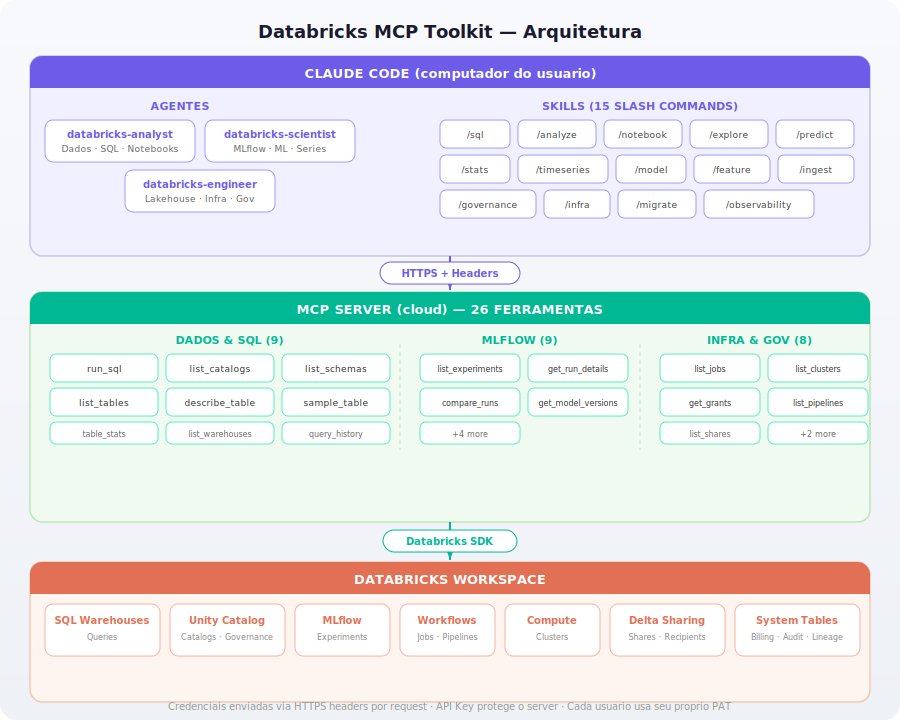

# Databricks MCP Toolkit

**Conecte o Claude Code ao seu workspace Databricks e transforme linguagem natural em queries, análises e notebooks, sem sair do terminal.**

O Databricks MCP Toolkit é um pacote completo de integração entre o [Claude Code](https://docs.anthropic.com/en/docs/claude-code) e o Databricks. Ele inclui um MCP Server com 18 ferramentas, 2 agentes especializados e 9 skills prontos para uso imediato.

---

## Por que usar

- **Sem troca de contexto**: tudo acontece no terminal onde você já está
- **SQL via linguagem natural**: descreva o que precisa, o agente monta a query
- **Exploração guiada**: navegue pelo Unity Catalog de forma progressiva e estruturada
- **Notebooks prontos**: gere arquivos `.py` no formato Databricks com um comando
- **Segurança por padrão**: credenciais ficam em arquivo protegido (`chmod 600`), nunca sobem no git

---

## O que está incluso

### Agentes

Acionados automaticamente pelo Claude Code conforme o tipo de tarefa.

| Agente | Perfil | Quando é acionado |
|---|---|---|
| `databricks-analyst` | Analista de Dados sênior | Exploração de dados, SQL, notebooks PySpark |
| `data-scientist` | Cientista de Dados / ML Engineer | MLflow, modelos preditivos, séries temporais |

[Ver detalhes dos agentes →](docs/agents.md)

### Skills — Slash Commands

| Comando | O que faz |
|---|---|
| `/sql` | Executar SQL ou gerar a partir de linguagem natural |
| `/analyze` | Análise exploratória completa (EDA) |
| `/notebook` | Criar notebook PySpark no formato Databricks |
| `/explore` | Navegar pelo Unity Catalog progressivamente |
| `/predict` | Pipeline ML completo (EDA → treino → MLflow) |
| `/stats` | Testes estatísticos avançados via SQL |
| `/timeseries` | Análise de séries temporais + forecasting |
| `/model` | Inspecionar experimentos, runs e endpoints MLflow |
| `/feature` | Análise de features e pipeline de engineering |

[Ver exemplos e detalhes →](docs/skills.md)

### Ferramentas MCP (18)

9 ferramentas de dados (SQL, Unity Catalog) + 9 de MLflow (experimentos, modelos, endpoints). O Claude Code chama diretamente via protocolo MCP.

[Ver lista completa →](docs/tools.md)

---

## Instalação

### Pré-requisitos

- Python 3.10+ com módulo `venv` (no Ubuntu/Debian: `sudo apt install python3.X-venv`)
- Git
- [Claude Code](https://docs.anthropic.com/en/docs/claude-code) instalado
- Token de acesso pessoal (PAT) do Databricks

### Instalação rápida (recomendada)

```bash
curl -fsSL https://raw.githubusercontent.com/rasterxdev/databricks-mcp-toolkit/main/setup.sh | bash
```

O instalador baixa tudo do GitHub, cria o ambiente virtual, pede suas credenciais e configura o Claude Code globalmente.

### Instalação a partir do clone

Para quem quer customizar ou contribuir:

```bash
git clone git@github.com:rasterxdev/databricks-mcp-toolkit.git && cd databricks-mcp-toolkit
./scripts/install.sh
```

---

## Atualização

O toolkit verifica automaticamente se há atualizações ao abrir o Claude Code. Se encontrar uma versão nova, você verá um aviso na primeira resposta de qualquer ferramenta MCP. Para atualizar, digite `/databricks-update` no chat ou rode manualmente:

```bash
~/.local/share/databricks-mcp/update.sh
```

---

## Uso

Após a instalação, basta abrir qualquer terminal e rodar:

```bash
claude
```

Pronto. Agentes, skills e ferramentas funcionam em qualquer projeto, sem configuração adicional.

---

## Arquitetura

<p align="center">
  
</p>

[Ver estrutura de pastas e detalhes →](docs/architecture.md)

---

## Documentação

| Tópico | Link |
|---|---|
| Agentes | [docs/agents.md](docs/agents.md) |
| Skills (slash commands) | [docs/skills.md](docs/skills.md) |
| Ferramentas MCP | [docs/tools.md](docs/tools.md) |
| Arquitetura e estrutura | [docs/architecture.md](docs/architecture.md) |
| Customização | [docs/customization.md](docs/customization.md) |
| Contribuição e onboarding | [docs/contributing.md](docs/contributing.md) |
| Troubleshooting | [docs/troubleshooting.md](docs/troubleshooting.md) |
| Changelog | [CHANGELOG.md](CHANGELOG.md) |
