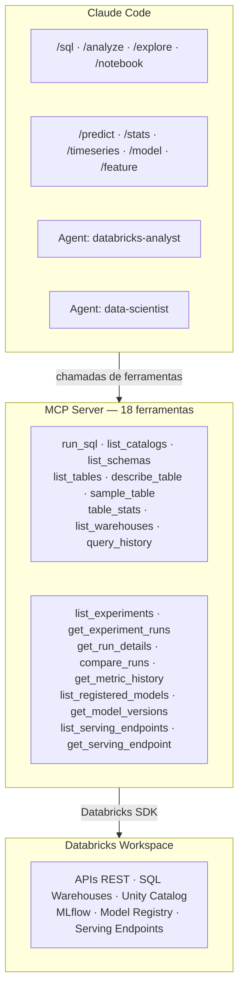

# Databricks MCP Toolkit

**Conecte o Claude Code ao seu workspace Databricks e transforme linguagem natural em queries, análises e notebooks, sem sair do terminal.**

O Databricks MCP Toolkit é um pacote completo de integração entre o [Claude Code](https://docs.anthropic.com/en/docs/claude-code) e o Databricks. Ele inclui um MCP Server com 18 ferramentas, 2 agentes especializados (dados e ciência de dados) e 9 skills (slash commands) prontos para uso imediato.

---

## Por que usar

Analistas e engenheiros de dados passam boa parte do dia alternando entre terminal, notebook, documentação de tabelas e UI do Databricks. Este toolkit elimina essa troca de contexto: você faz perguntas, explora catálogos, roda SQL e gera notebooks PySpark diretamente no Claude Code, usando linguagem natural ou comandos dedicados.

- **Sem troca de contexto**: tudo acontece no terminal onde você já está
- **SQL via linguagem natural**: descreva o que precisa, o agente monta a query
- **Exploração guiada**: navegue pelo Unity Catalog de forma progressiva e estruturada
- **Notebooks prontos**: gere arquivos `.py` no formato Databricks com um comando
- **Segurança por padrão**: credenciais ficam em arquivo protegido (`chmod 600`), nunca sobem no git

---

## Agentes disponíveis

O toolkit inclui dois agentes especializados, acionados automaticamente pelo Claude Code conforme o tipo de tarefa.

### `databricks-analyst`

| Atributo | Detalhe |
|---|---|
| **Modelo** | Sonnet |
| **Perfil** | Engenheiro de Dados e Analista sênior |
| **Ferramentas** | 9 ferramentas MCP de dados + Read, Write, Edit, Bash, Glob, Grep |

**Capacidades:**

1. **Exploração de dados**: navegar em catálogos, schemas e tabelas do Unity Catalog
2. **SQL Analytics**: escrever e executar queries SQL otimizadas
3. **Análise estatística**: gerar estatísticas descritivas, distribuições, correlações
4. **Data Quality**: identificar nulos, duplicatas, outliers e inconsistências
5. **PySpark**: escrever e revisar código PySpark para transformações
6. **Notebooks**: criar notebooks Databricks com análises completas

**Quando é acionado:**

O agente entra em ação quando você pede coisas como:
- "analisa a tabela X pra mim"
- "cria um notebook que calcula Y"
- "roda esse SQL e me explica o resultado"

**Fluxo de análise estruturado:**

O agente segue uma metodologia consistente: `describe_table` (entender colunas e tipos) → `table_stats` (visão geral de nulos e cardinalidade) → `sample_table` (ver dados reais) → `run_sql` (queries específicas de análise).

---

### `data-scientist`

| Atributo | Detalhe |
|---|---|
| **Modelo** | Sonnet |
| **Perfil** | Cientista de Dados sênior / ML Engineer |
| **Ferramentas** | Todas as 18 ferramentas MCP (dados + MLflow) + Read, Write, Edit, Bash, Glob, Grep |

**Capacidades:**

1. **ML Lifecycle**: explorar experimentos, runs, modelos e serving endpoints via MLflow
2. **Análise estatística avançada**: correlação, distribuições, testes de hipótese via SQL
3. **Feature engineering**: encoding, scaling, window features, lag features
4. **Pipelines preditivos**: classificação, regressão, AutoML com logging no MLflow
5. **Séries temporais**: tendência, sazonalidade, forecasting
6. **Avaliação de modelos**: métricas, comparação de runs, análise de convergência
7. **Analytics avançado**: clustering, anomalias, segmentação, cohort analysis

**Quando é acionado:**

O agente entra em ação quando você pede coisas como:
- "compara os últimos runs do experimento X"
- "cria um modelo preditivo para churn"
- "analisa a série temporal de vendas"
- "faz feature engineering na tabela Y"

---

## Skills - Slash Commands

Skills são atalhos que injetam prompts especializados no Claude Code. Basta digitar o comando no chat.

### `/sql` - Executar SQL

Executa queries SQL diretamente ou gera SQL a partir de linguagem natural.

```
/sql SELECT * FROM silver.ibge.ipca_mensal WHERE valor > 5 ORDER BY data_referencia
```

Também aceita linguagem natural:

```
/sql me mostra as 10 maiores variações do IPCA
```

**O que acontece por baixo:** se você fornece uma query pronta, ela é executada diretamente. Se descreve o que quer, o Claude primeiro inspeciona as tabelas com `describe_table`, monta a query e então executa.

---

### `/analyze` - Análise exploratória (EDA)

Executa uma análise exploratória completa de qualquer tabela.

```
/analyze silver.ibge.ipca_mensal
```

**Etapas executadas automaticamente:**

1. Leitura do schema (colunas e tipos)
2. Estatísticas descritivas (contagem, nulos, cardinalidade)
3. Amostra de dados reais
4. Distribuições de valores (categóricas, numéricas, temporais)
5. Verificações de data quality (nulos, duplicatas, outliers)

O resultado é apresentado em markdown organizado, com uma seção final de observações e insights.

---

### `/notebook` - Criar notebook PySpark

Gera um arquivo `.py` no formato nativo de notebooks Databricks.

```
/notebook análise de tendência do IPCA com média móvel de 3 meses
```

**O notebook gerado inclui:**

- Header `# Databricks notebook source`
- Separadores de célula `# COMMAND ----------`
- Células de documentação com `# MAGIC %md`
- Código PySpark estruturado e comentado
- Célula de validação/verificação ao final

---

### `/explore` - Navegar pelo Unity Catalog

Navegação progressiva pelo Unity Catalog, do nível mais alto até o detalhe de uma tabela.

```
/explore                           # lista catálogos
/explore silver                    # lista schemas do catálogo silver
/explore silver.ibge               # lista tabelas do schema ibge
/explore silver.ibge.ipca_mensal   # descreve a tabela completa
```

---

### `/predict` - Pipeline ML completo

Gera um notebook Databricks com pipeline de Machine Learning completo.

```
/predict classificar churn na tabela gold.clientes.features
```

**O notebook gerado inclui:** EDA, feature engineering, split treino/teste, treinamento com logging no MLflow, avaliação de métricas e registro do modelo.

---

### `/stats` - Análise estatística avançada

Executa testes estatísticos e análises avançadas usando funções SQL nativas do Databricks.

```
/stats correlação entre preço e volume na tabela silver.mercado.acoes
```

**Análises disponíveis:** estatísticas descritivas avançadas (skewness, kurtosis), correlação, detecção de outliers (IQR), distribuição de frequência, teste de normalidade aproximado.

---

### `/timeseries` - Séries temporais

Analisa séries temporais e gera notebooks de forecasting.

```
/timeseries tendência do IPCA em silver.ibge.ipca_mensal
```

**O que faz:** identifica tendência, sazonalidade, anomalias temporais, variação período a período, e opcionalmente gera um notebook de forecasting com Prophet ou ARIMA.

---

### `/model` - Gerenciar MLflow

Inspeciona experimentos, runs, modelos registrados e serving endpoints do MLflow.

```
/model list experiments
/model runs 123456
/model compare run_id1,run_id2
/model endpoints
```

---

### `/feature` - Feature engineering

Analisa features de uma tabela e gera pipelines de feature engineering.

```
/feature gold.clientes.transacoes target=churn
```

**O que faz:** classifica features por tipo, analisa correlação com target, recomenda transformações (encoding, scaling, window features) e opcionalmente gera um notebook com o pipeline completo.

---

## Ferramentas MCP

O MCP Server roda localmente e expõe 18 ferramentas que o Claude Code chama diretamente via o protocolo [MCP (Model Context Protocol)](https://modelcontextprotocol.io/) por `stdio`. O servidor é iniciado automaticamente ao abrir o projeto, conforme configurado no `.mcp.json`.

### Dados e SQL

| Ferramenta | Descrição | Exemplo de uso |
|---|---|---|
| `run_sql` | Executa query SQL e retorna resultados formatados em markdown | `run_sql("SELECT * FROM silver.ibge.ipca_mensal LIMIT 10")` |
| `list_catalogs` | Lista todos os catálogos do Unity Catalog | Exploração inicial do workspace |
| `list_schemas` | Lista schemas de um catálogo | `list_schemas("silver")` |
| `list_tables` | Lista tabelas de um schema | `list_tables("silver", "ibge")` |
| `describe_table` | Retorna schema detalhado (colunas, tipos, comentários) | `describe_table("silver.ibge.ipca_mensal")` |
| `sample_table` | Amostra rápida de dados de uma tabela | `sample_table("silver.ibge.ipca_mensal", rows=10)` |
| `table_stats` | Estatísticas: contagem, nulos, cardinalidade por coluna | `table_stats("silver.ibge.ipca_mensal")` |
| `list_warehouses` | Lista SQL Warehouses e seus estados | Verificar warehouse disponível |
| `query_history` | Histórico de queries recentes no workspace | Auditoria e debug |

### MLflow e Model Registry

| Ferramenta | Descrição | Exemplo de uso |
|---|---|---|
| `list_experiments` | Lista experimentos MLflow no workspace | Descobrir experimentos disponíveis |
| `get_experiment_runs` | Lista runs de um experimento com métricas e parâmetros | `get_experiment_runs("123456")` |
| `get_run_details` | Detalhes completos de um run (params, métricas, tags, artifacts) | `get_run_details("run_id")` |
| `compare_runs` | Compara múltiplos runs lado a lado | `compare_runs("run1,run2,run3")` |
| `get_metric_history` | Histórico de uma métrica ao longo dos steps | `get_metric_history("run_id", "loss")` |
| `list_registered_models` | Lista modelos no Unity Catalog Model Registry | Descobrir modelos registrados |
| `get_model_versions` | Lista versões de um modelo registrado | `get_model_versions("catalog.schema.model")` |
| `list_serving_endpoints` | Lista model serving endpoints | Verificar endpoints ativos |
| `get_serving_endpoint` | Detalhes de um serving endpoint específico | `get_serving_endpoint("my-endpoint")` |

**Como funciona a conexão:** o servidor carrega credenciais seguindo a prioridade: `.env` do projeto > `.databricks_mcp_cfg` global > perfil CLI. Seleciona automaticamente um SQL Warehouse em estado `RUNNING`. O client e o warehouse são cacheados para evitar reconexões desnecessárias. As ferramentas de MLflow e Model Registry usam o mesmo `WorkspaceClient` — sem dependências adicionais.

---

## Instalação

A instalação é feita uma única vez por máquina.

### Pré-requisitos

- Python 3.10+
- [Claude Code](https://docs.anthropic.com/en/docs/claude-code) instalado
- Acesso ao workspace Databricks
- Token de acesso pessoal (PAT) do Databricks

### Instalação rápida (recomendada)

Um comando. Sem clonar repo.

```bash
curl -fsSL https://raw.githubusercontent.com/rasterxdev/databricks-mcp-toolkit/main/setup.sh | bash
```

O instalador baixa tudo do GitHub, cria o ambiente virtual, pede suas credenciais Databricks e configura o Claude Code globalmente.

### Instalação a partir do clone

Alternativa para quem quer customizar ou contribuir:

```bash
git clone git@github.com:rasterxdev/databricks-mcp-toolkit.git && cd databricks-mcp-toolkit
./install.sh
```

### O que o instalador faz

1. **Dependências** — cria o ambiente virtual com `databricks-connect`, `databricks-sdk`, `mcp[cli]` e `python-dotenv`
2. **Credenciais** — pede `DATABRICKS_HOST`, `DATABRICKS_TOKEN` e opcionalmente `DATABRICKS_WAREHOUSE_ID`, salvando em `~/.local/share/databricks-mcp/.databricks_mcp_cfg` com permissões restritas (`chmod 600`)
3. **Instalação global** — instala agentes, skills e `.mcp.json` no `~/.claude/`, funcionando em qualquer terminal com Claude Code

---

## Uso

### Modo Global (recomendado)

Após a instalação global, basta abrir qualquer terminal e rodar:

```bash
claude
```

Pronto. O Databricks MCP já está disponível — agentes, skills e ferramentas funcionam em qualquer projeto, sem configuração adicional.

**Override por projeto:** se precisar usar credenciais diferentes em um projeto específico, crie um `.env` na raiz:

```bash
cat > .env << 'EOF'
DATABRICKS_HOST=https://<outro-workspace>.cloud.databricks.com/
DATABRICKS_TOKEN=<outro_token>
EOF
```

### Modo Por Projeto

Depois de instalado, rode em cada repositório:

```bash
cd ~/meu-projeto-databricks
databricks-mcp-init             # copia .mcp.json + agentes + skills
claude
```

As credenciais globais são usadas automaticamente. Não precisa criar `.env` a menos que queira um override local.

### Prioridade de credenciais

O servidor segue esta ordem de prioridade:

1. **`.env` do projeto** — override local (se existir)
2. **`.databricks_mcp_cfg`** — credenciais globais (criadas pelo instalador)
3. **Perfil CLI** — `~/.databrickscfg` (fallback)

> `DATABRICKS_WAREHOUSE_ID` é opcional em qualquer modo. Se omitido, o servidor usa automaticamente o primeiro warehouse em estado `RUNNING`.

---

## Arquitetura

O toolkit é composto por 3 camadas que trabalham juntas:



### Estrutura de pastas

**MCP Server** (instalação base, sempre criada):

```
~/.local/share/databricks-mcp/
├── server.py                     ← MCP Server (18 ferramentas)
├── .venv/                        ← Python + dependências
├── .databricks_mcp_cfg           ← Credenciais (chmod 600)
├── .install_mode                 ← Modo: global ou project
├── setup.sh                      ← Script de init (modo por projeto)
├── commands/                     ← Templates das skills
│   ├── sql.md, analyze.md, notebook.md, explore.md
│   ├── predict.md, stats.md, timeseries.md
│   ├── model.md, feature.md
└── agents/
    ├── databricks-analyst.md
    └── data-scientist.md
```

**Modo Global** (skills, agentes e MCP no `~/.claude/`):

```
~/.claude/
├── .mcp.json                     ← Config MCP (aponta para server global)
├── CLAUDE.md                     ← Instruções globais para o Claude Code
├── commands/                     ← Skills disponíveis em qualquer projeto
│   ├── sql.md, analyze.md, notebook.md, explore.md
│   ├── predict.md, stats.md, timeseries.md
│   ├── model.md, feature.md
└── agents/
    ├── databricks-analyst.md
    └── data-scientist.md
```

**Modo Por Projeto** (gerado pelo `databricks-mcp-init`):

```
~/qualquer-projeto/
├── .mcp.json                     ← Aponta para o server global (gitignored)
└── .claude/
    ├── commands/                  ← Skills copiadas
    │   ├── sql.md, analyze.md, notebook.md, explore.md
    │   ├── predict.md, stats.md, timeseries.md
    │   ├── model.md, feature.md
    └── agents/
        ├── databricks-analyst.md
        └── data-scientist.md
```

---

## Customização

### Credenciais

As credenciais são configuradas durante a instalação e salvas em `~/.local/share/databricks-mcp/.databricks_mcp_cfg`. Para override por projeto, crie um `.env` na raiz do projeto.

| Variável | Obrigatória | Descrição |
|---|---|---|
| `DATABRICKS_HOST` | Sim | URL do workspace (ex: `https://dbc-xxx.cloud.databricks.com/`) |
| `DATABRICKS_TOKEN` | Sim | Token de acesso pessoal (PAT) |
| `DATABRICKS_WAREHOUSE_ID` | Não | ID do SQL Warehouse. Se omitido, usa o primeiro em estado `RUNNING` |

Para reconfigurar credenciais, rode `./install.sh` novamente — o instalador detecta credenciais existentes e oferece a opção de mantê-las ou substituí-las.

### Adicionar novas ferramentas ao MCP Server

Edite `databricks_mcp/server.py` e adicione uma nova função decorada com `@mcp.tool()`:

```python
@mcp.tool()
def minha_ferramenta(parametro: str) -> str:
    """Descrição da ferramenta.

    Args:
        parametro: Descrição do parâmetro.
    """
    client = _get_client()
    # sua lógica aqui
    return "resultado"
```

Após editar, rode `./install.sh` novamente para atualizar a instalação global.

### Adicionar novas skills

Crie um arquivo `.md` em `.claude/commands/`:

```markdown
---
description: Descrição curta da skill
allowed-tools: mcp__databricks__run_sql, mcp__databricks__describe_table
---

Instruções para o Claude sobre o que fazer.

$ARGUMENTS
```

A skill fica disponível imediatamente como `/nome-do-arquivo`. Rode `./install.sh` para atualizar os templates globais.

---

## Compartilhamento e onboarding

### Para novos membros do time

1. Rode no terminal:
   ```bash
   curl -fsSL https://raw.githubusercontent.com/rasterxdev/databricks-mcp-toolkit/main/setup.sh | bash
   ```
2. O instalador pedirá o token Databricks (ver abaixo como gerar)
3. Pronto — qualquer terminal com Claude Code já funciona

### Gerando seu token Databricks

1. Acesse o workspace: `https://<seu-workspace>.cloud.databricks.com/`
2. Clique no seu perfil (canto superior direito) → **Settings**
3. Vá em **Developer** → **Access tokens**
4. Clique em **Generate new token**
5. Copie o token e cole no seu arquivo `.env`

### O que vai no git vs o que fica local

| Vai no git (este repo) | Fica local (por máquina) |
|---|---|
| `databricks_mcp/server.py` | `~/.local/share/databricks-mcp/` (instalação + credenciais) |
| `.claude/commands/*.md` | `~/.claude/` (modo global: agentes, skills, MCP config) |
| `.claude/agents/*.md` | `.env` (override de credenciais por projeto) |
| `install.sh` | `.claude/settings.local.json` (permissões locais) |
| `CLAUDE.md`, `README.md` | |

---

## Troubleshooting

| Problema | Solução |
|---|---|
| MCP Server não aparece | Reinicie o Claude Code (`exit` + `claude`) |
| Erro de autenticação | Verifique `~/.local/share/databricks-mcp/.databricks_mcp_cfg` ou o `.env` do projeto |
| Nenhum warehouse disponível | Acesse o workspace e inicie um SQL Warehouse |
| `wait_timeout` error | O timeout máximo da API é 50s, queries longas podem precisar de polling |
| Python não encontrado | Verifique se tem Python 3.10+ instalado (`python3 --version`) |
| `databricks-mcp-init` não encontrado | Apenas modo por projeto — rode `source ~/.zshrc` ou abra um novo terminal |
| Skills não aparecem | Verifique se `.claude/commands/` existe e tem os arquivos `.md` |
