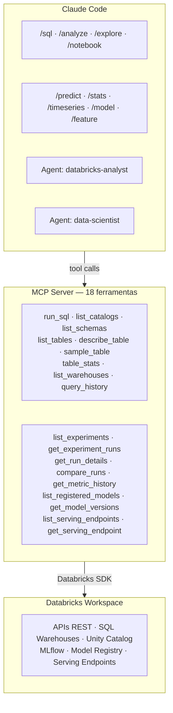

# Arquitetura

O toolkit é composto por 3 camadas que trabalham juntas:



---

## Estrutura de pastas

### MCP Server (instalação base, sempre criada)

```
~/.local/share/databricks-mcp/
├── server.py                     ← MCP Server (18 ferramentas)
├── .venv/                        ← Python + dependências
├── .databricks_mcp_cfg           ← Credenciais (chmod 600)
├── .version                      ← Versão instalada
├── update.sh                     ← Auto-updater
├── commands/                     ← Templates das skills
│   ├── sql.md, analyze.md, notebook.md, explore.md
│   ├── predict.md, stats.md, timeseries.md
│   ├── model.md, feature.md
└── agents/
    ├── databricks-analyst.md
    └── data-scientist.md
```

### Modo Global (skills, agentes e MCP no `~/.claude/`)

```
~/.claude/
├── .mcp.json                     ← Config MCP (aponta para server global)
├── CLAUDE.md                     ← Instruções globais para o Claude Code
├── commands/                     ← Skills disponíveis em qualquer projeto
│   ├── sql.md, analyze.md, notebook.md, explore.md
│   ├── predict.md, stats.md, timeseries.md
│   ├── model.md, feature.md
└── agents/
    ├── databricks-analyst.md
    └── data-scientist.md
```

### Modo Por Projeto (gerado pelo `databricks-mcp-init`)

```
~/qualquer-projeto/
├── .mcp.json                     ← Aponta para o server global (gitignored)
└── .claude/
    ├── commands/                  ← Skills copiadas
    │   ├── sql.md, analyze.md, notebook.md, explore.md
    │   ├── predict.md, stats.md, timeseries.md
    │   ├── model.md, feature.md
    └── agents/
        ├── databricks-analyst.md
        └── data-scientist.md
```

### Repositório (source of truth)

```
databricks-mcp-toolkit/
├── setup.sh                      ← Instalador remoto (curl | bash)
├── update.sh                     ← Auto-updater (baixado pelos instaladores)
├── VERSION                       ← Versão atual
├── CHANGELOG.md                  ← Histórico de releases
├── CLAUDE.md                     ← Instruções para agentes (este repo)
├── README.md                     ← Documentação principal
├── databricks_mcp/
│   └── server.py                 ← MCP Server (18 ferramentas)
├── .claude/
│   ├── commands/*.md             ← 10 skills
│   └── agents/*.md               ← 2 agentes
├── scripts/
│   ├── install.sh                ← Instalador via clone
│   ├── release.sh                ← Automação de release
│   └── post-release.sh           ← Publicação de release
└── docs/                         ← Documentação detalhada
```
